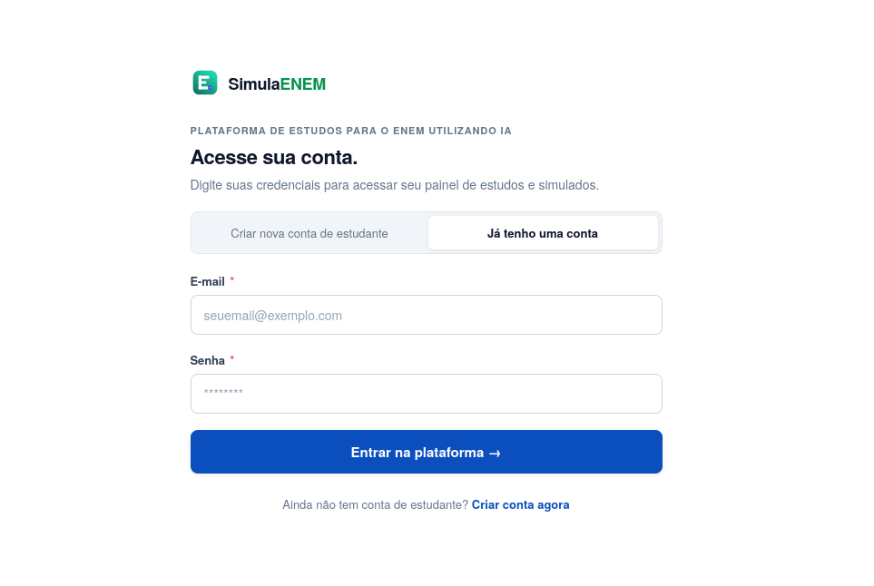
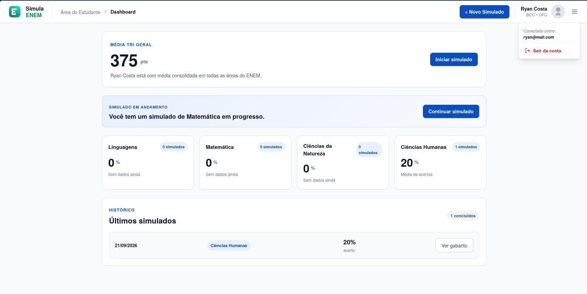
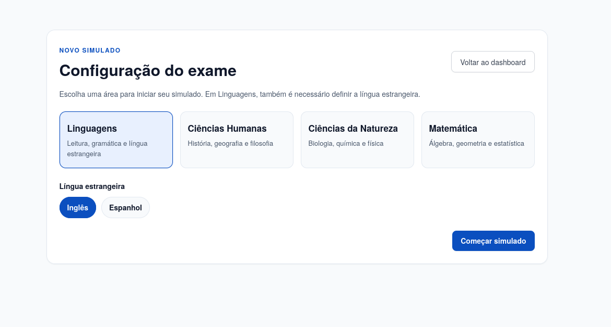
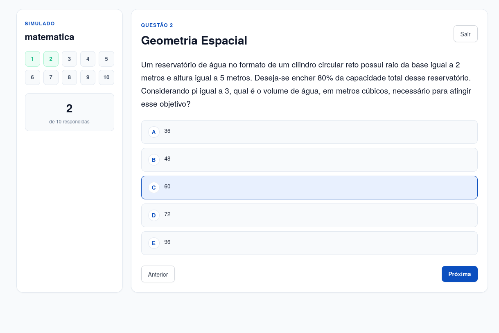
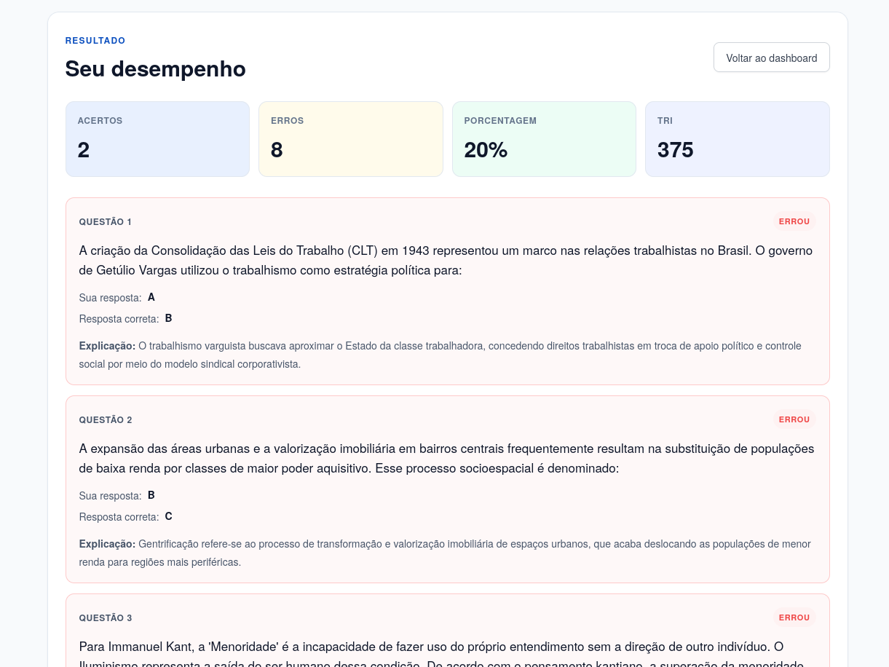

# SimulaENEM


> Plataforma de estudos para o ENEM que usa IA para criar simulados personalizados, acompanhar o desempenho e gerar uma estimativa de nota pela TRI.

A aplicação em produção pode ser acessada por aqui: [https://ryan-costa-enem-ai-challenge-phi.vercel.app/]

## Sobre o projeto

O SimulaENEM foi desenvolvido como uma plataforma de realiização de simulados para  ENEM para estudantes. O estudante cria uma conta, escolhe uma área do conhecimento, a plataforma solicita à IA um simulado com 10 questões no estilo ENEM, registra as respostas e apresenta uma análise do resultado.

Além da porcentagem de acertos, o sistema exibe uma estimativa de pontuação TRI, o desempenho por área e o histórico dos simulados já realizados. A proposta é oferecer um ciclo de estudo simples:

1. escolher uma área de conhecimento;
2. praticar com questões variadas;
3. receber explicações para cada resposta;
---

## Tecnologias

- Vite/React para o frontend
- Fastify para o backend
- MongoDB como banco de dados
---

## Funcionalidades

- Cadastro de estudantes com nome, e-mail e senha e informações adicionais.
- Login com autenticação por token JWT.
- Persistência da sessão do estudante em cookie.
- Rotas protegidas para impedir o acesso de usuários não autenticados.
- Dashboard com:
	  - média TRI geral;
	  - médias de acerto por área;
	  - quantidade de simulados concluídos;
	  - histórico dos simulados recentes;
	  - acesso a um simulado em andamento.
	
- Criação de simulados para:
	  - Linguagens;
	  - Matemática;
	  - Ciências da Natureza;
	  - Ciências Humanas.
	
- Seleção de Inglês ou Espanhol para a área de Linguagens.
- Geração automática de 10 questões pela API do Google Gemini.
- Questões com cinco alternativas, resposta correta, disciplina e explicação.
- Navegação entre questões com indicador visual de progresso.
- Salvamento local do progresso do simulado para permitir retomada durante a sessão.
- Validação para exigir o preenchimento das questões antes do envio.
- Resultado detalhado com acertos, erros, porcentagem, TRI e explicação de cada questão.
- Persistência de usuários, simulados, respostas e resultados no MongoDB.
- Validação de payloads com Zod e tratamento padronizado de erros da API
---
### Geração de questões

Ao criar um simulado, o backend monta um prompt de acordo com a área escolhida. A IA deve retornar exatamente 10 questões  com cinco alternativas, apenas uma resposta correta, disciplina e explicação.

Na área de Linguagens, o prompt combina oito questões em português com duas questões de Inglês ou Espanhol, conforme escolha.

O backend também envia um schema de resposta estruturada para o Gemini. Dessa forma, a resposta esperada é JSON e é validada antes de ser persistida.

---
### Estimativa de TRI

Depois que o estudante responde ao simulado, o backend envia para a IA o desempenho por questão: disciplina, resposta correta, resposta selecionada e indicação de acerto. A IA retorna uma estimativa numérica de 0 a 1000 e um raciocínio resumido (simulando uma TRI).

---
## Demonstração

### Login e cadastro



### Dashboard



### Criação do simulado



### Questões e progresso



### Resultado e explicações



## Arquitetura

O projeto está organizado em duas aplicações independentes:

```text
.
├── backend/
│   ├── src/
│   │   ├── config/       
│   │   ├── errors/       
│   │   ├── middlewares/  # Autenticação
│   │   ├── models/       # Models do MongoDB e tipos de domínio
│   │   ├── routes/       
│   │   ├── services/     # Regras de negócio
│   │   └── zod/          # DTOs
│   └── package.json
├── frontend/
│   ├── src/
│   │   ├── components/   
│   │   ├── contexts/     # Estado global de autenticação
│   │   ├── pages/        
│   │   ├── routes/       
│   │   ├── services/     # Cliente HTTP e contratos da API
│   │   └── utils/        # Cookie e persistência do progresso
│   └── package.json
└── README.md
```

### Frontend

O frontend foi construido utilizando React, TypeScript e Vite. O React Router organiza as rotas públicas e privadas, enquanto o AuthContext centraliza login, cadastro, logout, restauração da sessão e carregamento do usuário.

A interface mantém as respostas selecionadas no estado da página e salva o progresso localmente para que um simulado em andamento possa ser retomado.

### Backend

O backend usa Fastify com TypeScript com uma arquitetura em camadas. As routes executam os services que, por sua vez, realiza as lógicas de negócio e persistência.

- **Fastify:** framewrok backend.
- **Zod:** validação das requisições.
- **JWT:** proteção de autenticação.
- **Argon2:** hash de senhas.
- **Mongoose:** conexão  com MongoDB.
- **Google GenAI:** geração das questões e estimativa TRI.

## Rotas da API

| Método | Rota | Descrição | Autenticação |
|---|---|---|---|
| `GET` | `/health` | Verifica se a API está disponível | Não |
| `POST` | `/users` | Cria um estudante | Não |
| `POST` | `/auth/login` | Autentica e retorna um JWT | Não |
| `GET` | `/auth/me` | Retorna o estudante autenticado | Sim |
| `POST` | `/exams` | Gera e cria um novo simulado | Sim |
| `GET` | `/exams` | Lista os simulados do estudante | Sim |
| `GET` | `/exams/:id` | Consulta um simulado específico | Sim |
| `POST` | `/exams/:id/submit` | Envia respostas e calcula o resultado | Sim |

As rotas autenticadas recebem o token no header:

```http
Authorization: Bearer SEU_TOKEN
```

## Como executar localmente

### Pré-requisitos

- Node.js 20+;
- npm;
- uma instância do MongoDB;
- uma chave da API do Google Gemini.

### 1. Clone o repositório

```bash
git clone https://github.com/ryanpabloac/ryan-costa-enem-ai-challenge.git
cd ryan-costa-enem-ai-challenge
```

### 2. Configure o backend

Abra um terminal na pasta `backend`:

```bash
cd backend
npm install
```

Crie o arquivo `backend/.env` com base no exemplo:

```env
HOST=127.0.0.1
PORT=3333
DB_URL=mongodb://127.0.0.1:27017/simula-enem
SECRET=troque-por-uma-chave-secreta-forte
GEMINI_API_KEY=cole-sua-chave-do-gemini-aqui
```

Inicie a API em modo de desenvolvimento:

```bash
npm run dev
```

A API ficará disponível na HOST e POR definidos no .env . Para saber se a API está funcionando utilize a rota `/health`.

### 3. Configure o frontend

Em outro terminal, a partir da raiz do projeto:

```bash
cd frontend
npm install
```

Crie o arquivo `frontend/.env`:

Nela será armazenado a rota do backend.

```env
VITE_API_URL=http://localhost:3333
```

Inicie a aplicação:

```bash
npm run dev
```

Abra `http://localhost:3000` no navegador.

## Variáveis de ambiente

| Aplicação | Variável         | Obrigatória | Finalidade                                 |
| --------- | ---------------- | ----------: | ------------------------------------------ |
| Backend   | `HOST`           |         Não | Host de escuta; padrão 0.0.0.0             |
| Backend   | `PORT`           |         Não | Porta da API; padrão `3333`                |
| Backend   | `DB_URL`         |         Sim | URL de conexão com o MongoDB               |
| Backend   | `SECRET`         |         Sim | Segredo usado na assinatura dos tokens JWT |
| Backend   | `GEMINI_API_KEY` |         Sim | Chave de acesso à API do Google Gemini     |
| Frontend  | `VITE_API_URL`   |         Não | URL base da API                            |

## Implementações que faltaram e gostaria de adicionar

- Adicionar testes unitários e de integração para o backend.
- Implementar uma documentação de API.
- Correções de redações utilizando IA.
- Adicionar filtros e gráficos mais completos ao dashboard.
- Permitir escolher quantidade, dificuldade e disciplinas do simulado.

